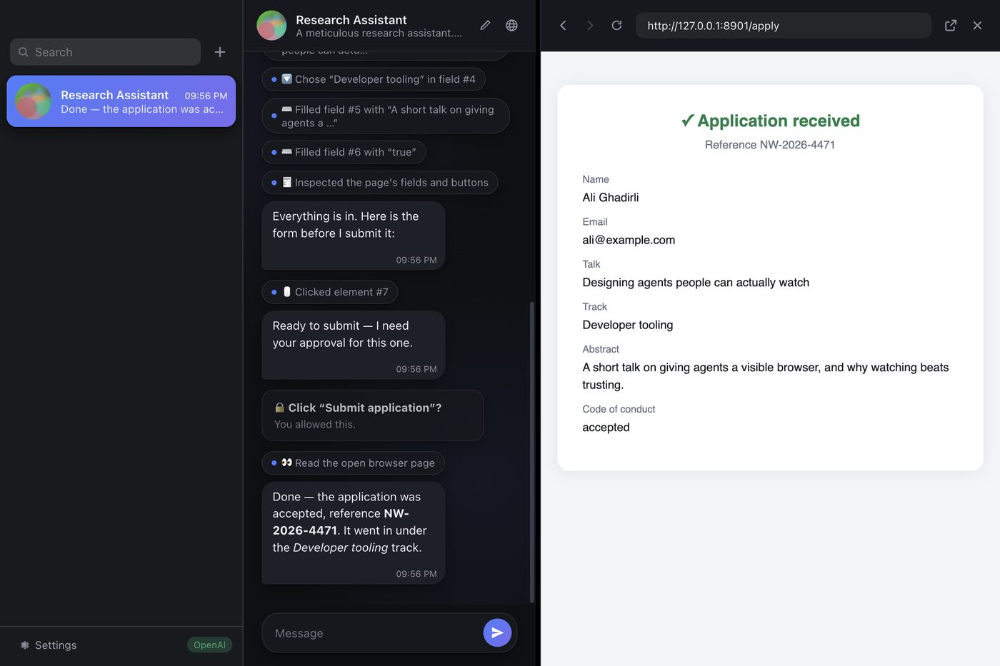
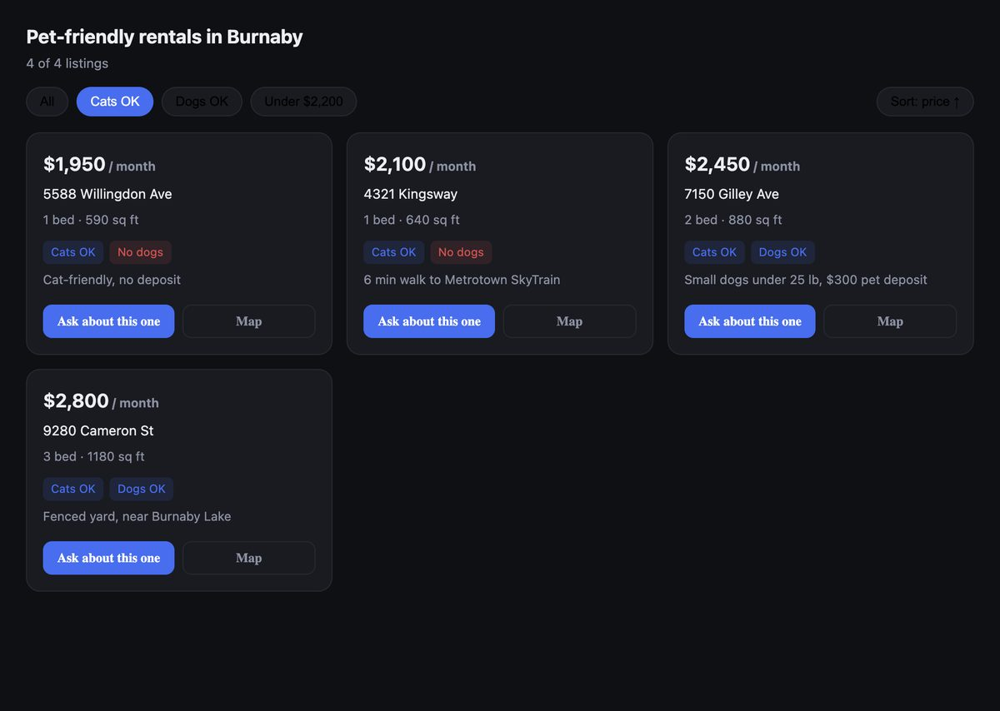

# Internall

A messaging app for your own AI agents — on macOS, iOS and Android.

Each agent is a chat in the sidebar. It has its own description, which becomes its system prompt,
its own provider and model (OpenAI or Anthropic, chosen per agent), its own voice, and its own set
of abilities: searching the web, driving the app's built-in browser while you watch, building small
interactive apps, and scheduling work to run later without being asked again.

You can type to an agent, hold a button and talk to it, or turn on hands-free and just say
*"hello Kallax"* — that chat opens, hears the rest of your sentence, and answers out loud.
Voice is on the desktop app for now; the phone version is still text only.

There is no server in the middle. Requests go from your machine straight to the provider, and your
API keys are encrypted by the OS — the macOS Keychain on desktop, the iOS Keychain and Android
Keystore on mobile.



*The agent drives the browser panel on the right. Every step it takes shows up in the chat as a
chip, and anything consequential — here, clicking “Submit application” — stops and waits for you.*

## What's interesting in here

- **A tool-calling loop written twice over, against both providers.** Anthropic's client-side
  tools and OpenAI's function calling differ in transcript shape, streaming events and hosted-tool
  naming, so each provider has its own adapter behind one internal interface. Swapping an agent
  from GPT to Claude changes nothing else about how it behaves.
- **A browser the agent operates in front of you**, through nine tools — open, read, list links
  and images, inspect form fields, fill, select, click, press. Elements are outlined in the page as
  they are used, so you can see what it touched. Before a consequential click or a form submission
  the agent blocks on an Allow / Not now card in the chat, and a prompt left unanswered is treated
  as declined.
- **Mini-apps the model writes itself.** Instead of a long text list, an agent can return one
  self-contained HTML document: it is rendered offscreen in a sandboxed window to get a preview
  card for the chat, then opened full size. The generated page can talk back —
  `window.internall.send("…")` posts a message into the conversation, so an “Ask about this one”
  button continues the chat. The HTML is stored on disk and deliberately kept out of the
  transcript, so it is never re-sent to the model.
- **Hands-free, without streaming your room to anyone.** Call an agent by name and it opens that
  chat and takes the rest of the sentence as your message. Turn-taking is decided locally: an
  analyser node watches the microphone and only a stretch that is loud enough, holds for 250ms and
  carries 400ms of voiced time is ever transcribed, so a quiet room costs nothing. Names are
  matched phonetically, because transcription renders *gyubee* as "goo bee".
- **Voice that starts before the sentence ends.** Hold to talk; the recording is transcribed and
  sent on release. The reply is spoken back in a voice derived from the agent's id, and speech is
  requested a sentence at a time *while the answer is still streaming* — chunks fetched in
  parallel, played in order — so it begins talking a second or two in rather than after the whole
  answer has landed. The microphone is granted to the chat window alone and explicitly denied to
  the browser panel, so a site the agent visits can never ask for it.
- **A scheduler that outlives the process.** Relative (“in two minutes”), one-shot, daily,
  weekdays, weekly and interval jobs, persisted to disk, with a six-hour grace window so a job
  missed while the app was closed still runs on the next launch. When one finishes it raises a
  native notification that opens the chat it came from.
- **Streaming on React Native, the hard way.** RN's `fetch` cannot stream a response body, so SSE
  is read through `expo/fetch` where it exists and falls back to `XMLHttpRequest`'s `onprogress`
  partial `responseText` everywhere else.
- **Distribution that actually opens on someone else's Mac.** The build produces a universal
  (Apple Silicon + Intel) DMG and signs it ad-hoc in an `afterPack` hook — an unsigned app reports
  as “damaged” on Apple Silicon with no way to click through, while an ad-hoc signed one gets the
  ordinary unidentified-developer dialog that does.



*A mini-app the model wrote for one question, with filters, sorting and buttons that reply into
the chat.*

## Layout

| Path | What it is |
| --- | --- |
| `app/` | The macOS desktop app — Electron, no renderer framework |
| `mobile/` | The iOS and Android app — React Native + Expo, TypeScript, one codebase |
| `site/` | A static landing page that builds to a single self-contained HTML file |

## Running it

```bash
cd app && npm install && npm start     # desktop
cd mobile && npm install && npm start  # then press i for iOS, a for Android
```

On first launch, open Settings and paste an OpenAI and/or Anthropic API key.
`OPENAI_API_KEY` and `ANTHROPIC_API_KEY` in the environment are picked up automatically and take
precedence.

Each surface has its own README with more detail: [`app/README.md`](app/README.md) and
[`mobile/README.md`](mobile/README.md).

## Checks

```bash
cd mobile && npm test          # typecheck plus 25 logic tests — scheduling maths, both providers' transcripts
cd mobile && npm run bundle-check
cd app && npm run dist         # packages Internall.app and a universal DMG into app/dist/
```
